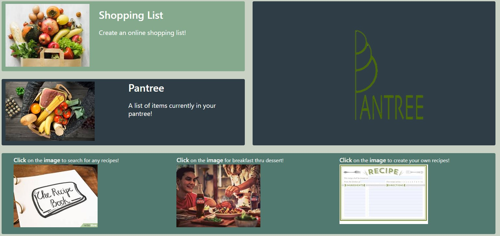

# my-portfolio

Link to application: https://polar-reaches-63897.herokuapp.com/

Pantree is an application to manage what food you have at home, what you need to grocery shop for and what you can cook with the ingredients you have in your pantry. This application can help save you money, time and stress in determining what you can cook at home. 

### Background
As someone that is very busy, I want to be able to see what is in my kitchen and what I can make with those ingredients.  Pantree manages this by: 
1. Stores what you have in your pantry at home.  This will soon include a countdown for when that food will likely expire.
2. Find recipes that maximize the ingredients in your kitchen.  
3. Generate a shopping list based off what you don't have in your pantry.  

### Tech Used
1. Bulma
2. Spoonacular
3. Sketchup
4. Handlebars
5. Express
6. Passport
7. Sequelize
8. Axios
9. JQuery

### Contributors
| [Brent Peterson](https://github.com/brentp24) | 
| [Alexander Hamilton](https://github.com/ajhami)  | 
| [Scott Morrison](https://github.com/scottmorr) | 
| [James Brooks](https://github.com/Jahugawugasuga) | 

### Future Development
1. Add expiration date and countdown to the pantree list 
2. Weekly meal planning 
3. Search meals for the week, ingredients added to your shopping lists, duplicates will be confirmed, existing items in pantree will be confirmed before adding to the list
4. Easily share recipes between friends/family
5. App integration - voice commands “Alexa, add eggs to the Pantree List”
6. Clip art for ingredient items for quick reference
7. Expanded expiring foods database
8. Take a picture of receipt and add to Pantree
9. Sort by category of groceries
10. Sort by what you should eat next. 

